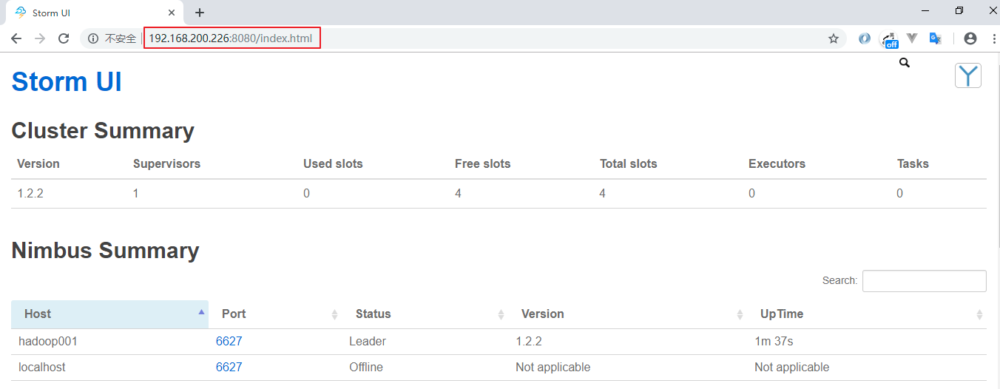
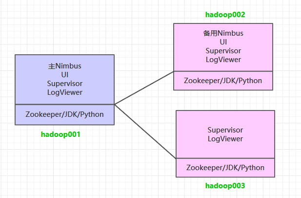
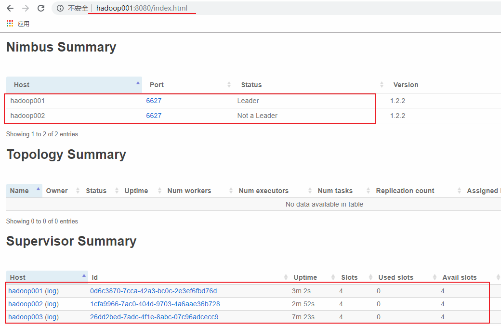

## 一、Storm单机版本环境搭建

### （1）安装环境要求

> you need to install Storm's dependencies on Nimbus and the worker machines. These are:
>
> 1. Java 7+ (Apache Storm 1.x is tested through travis ci against both java 7 and java 8 JDKs)
> 2. Python 2.6.6 (Python 3.x should work too, but is not tested as part of our CI enviornment)

按照[官方文档](http://storm.apache.org/releases/1.2.2/Setting-up-a-Storm-cluster.html) 的说明：storm 运行依赖于 Java 7+ 和 Python 2.6.6 +，所以需要预先安装这两个软件

- **安装JDK** 

  - 下载并解压

  &emsp;&emsp;在[官网](https://www.oracle.com/technetwork/java/javase/downloads/index.html) 下载所需版本的 JDK，这里我下载的版本为[JDK 1.8](https://www.oracle.com/technetwork/java/javase/downloads/jdk8-downloads-2133151.html) ,下载后进行解压：

  ```shell
  [root@ java]# tar -zxvf jdk-8u201-linux-x64.tar.gz
  ```

  - 设置环境变量

  ```shell
  [root@ java]# vi /etc/profile
  ```

  &emsp;&emsp;添加如下配置：

  ```shell
  export JAVA_HOME=/usr/java/jdk1.8.0_201  
  export JRE_HOME=${JAVA_HOME}/jre  
  export CLASSPATH=.:${JAVA_HOME}/lib:${JRE_HOME}/lib  
  export PATH=${JAVA_HOME}/bin:$PATH
  ```

  &emsp;&emsp;执行 `source` 命令，使得配置立即生效：

  ```shell
  [root@ java]# source /etc/profile
  ```

  - 检查是否成功

  ```shell
  [root@ java]# java -version
  ```

  &emsp;&emsp;显示出对应的版本信息则代表安装成功。

  ```shell
  java version "1.8.0_201"
  Java(TM) SE Runtime Environment (build 1.8.0_201-b09)
  Java HotSpot(TM) 64-Bit Server VM (build 25.201-b09, mixed mode)
  ```


- **安装Python**

  > **系统环境**：centos 7.6
  >
  > **Python 版本**：Python-3.6.8

  - **环境依赖** 

  &emsp;Python3.x 的安装需要依赖这四个组件：gcc， zlib，zlib-devel，openssl-devel；所以需要预先安装，命令如下：

  ```shell
  yum install gcc -y
  yum install zlib -y
  yum install zlib-devel -y
  yum install openssl-devel -y
  ```

  - **下载编译**

  &emsp;Python 源码包下载地址： https://www.python.org/downloads/

  ```shell
  # wget https://www.python.org/ftp/python/3.6.8/Python-3.6.8.tgz
  ```

  - **解压编译** 

  ```shell
  # tar -zxvf Python-3.6.8.tgz
  ```

  &emsp;进入根目录进行编译，可以指定编译安装的路径，这里我们指定为 `/usr/app/python3.6` ：

  ```shell
  # cd Python-3.6.8
  # ./configure --prefix=/usr/app/python3.6
  # make && make install
  ```

  - **环境变量配置**

  ```shell
  vim  /etc/profile
  ```

  ```shell
  export PYTHON_HOME=/usr/app/python3.6
  export  PATH=${PYTHON_HOME}/bin:$PATH
  ```

  ​	使得配置的环境变量立即生效：

  ```shell
  source /etc/profile
  ```

  - **验证安装是否成功** 

  &emsp;输入 `python3` 命令，如果能进入 python 交互环境，则代表安装成功：

  ```shell
  [root@hadoop001 app]# python3
  Python 3.6.8 (default, Mar 29 2019, 10:17:41)
  [GCC 4.8.5 20150623 (Red Hat 4.8.5-36)] on linux
  Type "help", "copyright", "credits" or "license" for more information.
  >>> 1+1
  2
  >>> exit()
  [root@hadoop001 app]#
  ```

  

### （2）下载并解压

&emsp;下载并解压，官方下载地址：http://storm.apache.org/downloads.html 

```shell
# tar -zxvf apache-storm-1.2.2.tar.gz
```


### （3）配置环境变量

```shell
# vim /etc/profile
```

&emsp;添加环境变量：

```shell
export STORM_HOME=/usr/app/apache-storm-1.2.2
export PATH=$STORM_HOME/bin:$PATH
```

&emsp;使得配置的环境变量生效：

```shell
# source /etc/profile
```


### （4）启动相关进程

&emsp;因为要启动多个进程，所以统一采用后台进程的方式启动。进入到 `${STORM_HOME}/bin` 目录下，依次执行下面的命令：

```shell
# 启动zookeeper
nohup sh storm dev-zookeeper &
# 启动主节点 nimbus
nohup sh storm nimbus &
# 启动从节点 supervisor 
nohup sh storm supervisor &
# 启动UI界面 ui  
nohup sh storm ui &
# 启动日志查看服务 logviewer 
nohup sh storm logviewer &
```


### （5）验证是否启动成功

&emsp;验证方式一：jps 查看进程：

```shell
[root@hadoop001 app]# jps
1074 nimbus
1283 Supervisor
620 dev_zookeeper
1485 core
9630 logviewer
```

&emsp;验证方式二： 访问 8080 端口，查看 Web-UI 界面：




## 二、Storm集群环境搭建

### （1）集群规划

&emsp;这里搭建一个 3 节点的 Storm 集群：三台主机上均部署 `Supervisor` 和 `LogViewer` 服务。同时为了保证高可用，除了在 hadoop001 上部署主 `Nimbus` 服务外，还在 hadoop002 上部署备用的 `Nimbus` 服务。`Nimbus` 服务由 Zookeeper 集群进行协调管理，如果主 `Nimbus` 不可用，则备用 `Nimbus` 会成为新的主 `Nimbus`。




### （2）前置条件

&emsp;Storm 运行依赖于 Java 7+ 和 Python 2.6.6 +，所以需要预先安装这两个软件。同时为了保证高可用，这里我们不采用 Storm 内置的 Zookeeper，而采用外置的 Zookeeper 集群。

- Linux 环境下 JDK 安装
- Linux 环境下 Python 安装
- Zookeeper 单机环境和集群环境搭建


### （3）集群搭建

#### > 下载并解压

&emsp;下载安装包，之后进行解压。官方下载地址：http://storm.apache.org/downloads.html 

```shell
# 解压
tar -zxvf apache-storm-1.2.2.tar.gz

```

#### > 配置环境变量

```shell
# vim /etc/profile
```

&emsp;添加环境变量：

```shell
export STORM_HOME=/usr/app/apache-storm-1.2.2
export PATH=$STORM_HOME/bin:$PATH
```

&emsp;使得配置的环境变量生效：

```shell
# source /etc/profile
```

#### > 集群配置

&emsp;修改 `${STORM_HOME}/conf/storm.yaml` 文件，配置如下：

```yaml
# Zookeeper集群的主机列表
storm.zookeeper.servers:
     - "hadoop001"
     - "hadoop002"
     - "hadoop003"

# Nimbus的节点列表
nimbus.seeds: ["hadoop001","hadoop002"]

# Nimbus和Supervisor需要使用本地磁盘上来存储少量状态（如jar包，配置文件等）
storm.local.dir: "/home/storm"

# workers进程的端口，每个worker进程会使用一个端口来接收消息
supervisor.slots.ports:
     - 6700
     - 6701
     - 6702
     - 6703
```

&emsp;`supervisor.slots.ports` 参数用来配置 workers 进程接收消息的端口，默认每个 supervisor 节点上会启动 4 个 worker，当然你也可以按照自己的需要和服务器性能进行设置，假设只想启动 2 个 worker 的话，此处配置 2 个端口即可。

#### > 安装包分发

&emsp;将 Storm 的安装包分发到其他服务器，分发后建议在这两台服务器上也配置一下 Storm 的环境变量。

```shell
scp -r /usr/app/apache-storm-1.2.2/ root@hadoop002:/usr/app/
scp -r /usr/app/apache-storm-1.2.2/ root@hadoop003:/usr/app/
```


### （4）启动集群

#### > 启动ZooKeeper集群

&emsp;分别到三台服务器上启动 ZooKeeper 服务：

```shell
 zkServer.sh start
```

#### > 启动Storm集群

&emsp;因为要启动多个进程，所以统一采用后台进程的方式启动。进入到 `${STORM_HOME}/bin` 目录下，执行下面的命令：

**hadoop001 & hadoop002 ：**

```shell
# 启动主节点 nimbus
nohup sh storm nimbus &
# 启动从节点 supervisor 
nohup sh storm supervisor &
# 启动UI界面 ui  
nohup sh storm ui &
# 启动日志查看服务 logviewer 
nohup sh storm logviewer &
```

**hadoop003 ：**

&emsp;hadoop003 上只需要启动 `supervisor` 服务和 `logviewer` 服务：

```shell
# 启动从节点 supervisor 
nohup sh storm supervisor &
# 启动日志查看服务 logviewer 
nohup sh storm logviewer &
```


#### > 查看集群

&emsp;使用 `jps` 查看进程，三台服务器的进程应该分别如下：


&emsp;访问 hadoop001 或 hadoop002 的 `8080` 端口，界面如下。可以看到有一主一备 2 个 `Nimbus` 和 3 个 `Supervisor`，并且每个 `Supervisor` 有四个 `slots`，即四个可用的 `worker` 进程，此时代表集群已经搭建成功。

  


### （5）高可用验证

&emsp;这里手动模拟主 `Nimbus` 异常的情况，在 hadoop001 上使用 `kill` 命令杀死 `Nimbus` 的线程，此时可以看到 hadoop001 上的 `Nimbus` 已经处于 `offline` 状态，而 hadoop002 上的 `Nimbus` 则成为新的 `Leader`。


