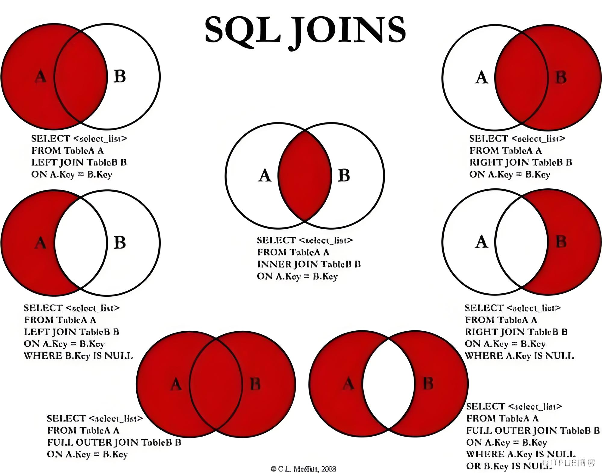

## 一、数据一致性校验

### 1) 核对两表总条数

select count(*) n from tmp.dm_cr_a_t_fenqi_product_rate_stat_1m_01 where data_month ='2025-02';

select count(*) n from tmp.dm_cr_a_t_fenqi_product_rate_stat_1m_02 where data_month ='2025-02';

#### --左表有，右表没有的总条数

select count(*) n
from tmp.dm_cr_a_t_fenqi_product_rate_stat_1m_01 t1
left join tmp.dm_cr_a_t_fenqi_product_rate_stat_1m_02 t2 
on t1.STAT_MONTH = t2.STAT_MONTH 
	and t1.PROD_TYP_CD = t2.PROD_TYP_CD
	and t1.CNL_NO = t2.CNL_NO
	and t1.prov = t2.prov
	and t1.city = t2.city 
	and t2.data_month ='2025-02'
where t1.data_month ='2025-02'
	and t2.city is null ;

#### --右表有，左表没有的总条数

select count(*) n
from tmp.dm_cr_a_t_fenqi_product_rate_stat_1m_01 t1
right join tmp.dm_cr_a_t_fenqi_product_rate_stat_1m_02 t2 
on t1.STAT_MONTH = t2.STAT_MONTH 
	and t1.PROD_TYP_CD = t2.PROD_TYP_CD
	and t1.CNL_NO = t2.CNL_NO
	and t1.prov = t2.prov
	and t1.city = t2.city 
	and t1.data_month ='2025-02'
where t2.data_month ='2025-02'
	and t1.city is null ;

#### --根据重要字段，统计左右表是否一致

select *
from (
	select STAT_MONTH
	,PROD_TYP_CD
	,PROD_TYP
	,CNL_NO
	,CNL_NM
	,PROV
	,CITY
	,md5(concat(
		nvl(STAT_MONTH,''),nvl(PROD_TYP_CD,''),nvl(PROD_TYP,''),
		nvl(CNL_NO,''),nvl(CNL_NM,''),nvl(PROV,''),nvl(CITY,'')
	)) md5_data
	from tmp.dm_cr_a_t_fenqi_product_rate_stat_1m_01
	where data_month ='2025-02'
)t1 
left join (
	select STAT_MONTH
	,PROD_TYP_CD
	,PROD_TYP
	,CNL_NO
	,CNL_NM
	,PROV
	,CITY
	,md5(concat(
		nvl(STAT_MONTH,''),nvl(PROD_TYP_CD,''),nvl(PROD_TYP,''),
		nvl(CNL_NO,''),nvl(CNL_NM,''),nvl(PROV,''),nvl(CITY,'')
	)) md5_data
	from tmp.dm_cr_a_t_fenqi_product_rate_stat_1m_02 
	where data_month ='2025-02'
)t2 
on t1.md5_data=t2.md5_data
where t2.md5_data is null ;

#### --调换左右表

select *
from (
	select STAT_MONTH
	,PROD_TYP_CD
	,PROD_TYP
	,CNL_NO
	,CNL_NM
	,PROV
	,CITY
	,md5(concat(
		nvl(STAT_MONTH,''),nvl(PROD_TYP_CD,''),nvl(PROD_TYP,''),
		nvl(CNL_NO,''),nvl(CNL_NM,''),nvl(PROV,''),nvl(CITY,'')
	)) md5_data
	from tmp.dm_cr_a_t_fenqi_product_rate_stat_1m_02
	where data_month ='2025-02'
)t1 
left join (
	select STAT_MONTH
	,PROD_TYP_CD
	,PROD_TYP
	,CNL_NO
	,CNL_NM
	,PROV
	,CITY
	,md5(concat(
		nvl(STAT_MONTH,''),nvl(PROD_TYP_CD,''),nvl(PROD_TYP,''),
		nvl(CNL_NO,''),nvl(CNL_NM,''),nvl(PROV,''),nvl(CITY,'')
	)) md5_data
	from tmp.dm_cr_a_t_fenqi_product_rate_stat_1m_01 
	where data_month ='2025-02'
)t2 
on t1.md5_data=t2.md5_data
where t2.md5_data is null ;

